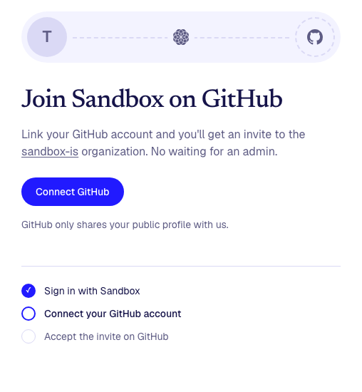
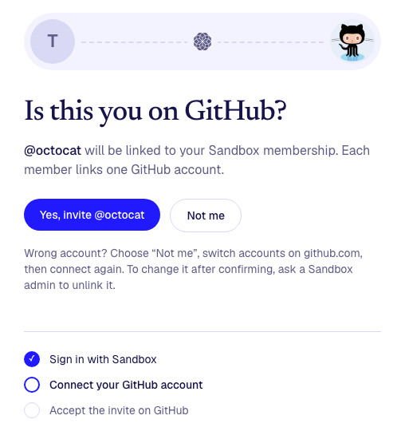
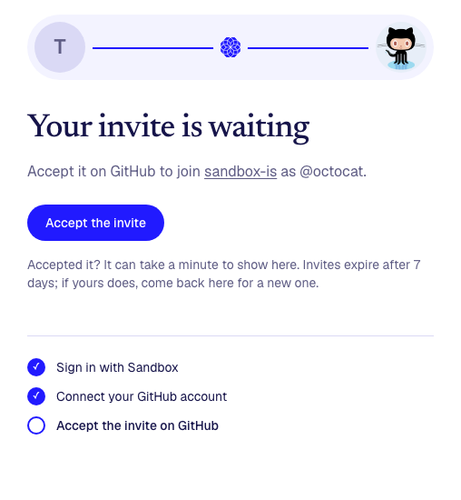
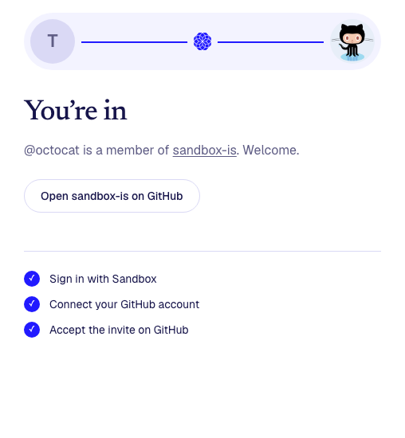

# Join Sandbox on GitHub

Sandbox members join the [sandbox-is](https://github.com/sandbox-is) GitHub
organization by themselves, without waiting for an admin.

**Live at https://join-github.vercel.app**

<p>
  
  
</p>
<p>
  
  
</p>

## How it works

1. **Sign in with Sandbox.** That proves you're a member.
2. **Connect GitHub.** You sign in on GitHub so the app knows which account is
   yours. It only sees your public profile, and doesn't keep GitHub's access.
3. **Confirm it's you.** The app shows your GitHub username and photo.
4. **Accept the invite.** The app sends an invite to sandbox-is; accept it at
   [github.com/orgs/sandbox-is/invitation](https://github.com/orgs/sandbox-is/invitation).
   If you're already in, or already invited, it says so instead.

Each Sandbox member can link one GitHub account, and each GitHub account can
belong to one member. Invites expire after 7 days; come back to the app for a
new one.

## Bring your app to sandbox-is

Once you're in, you can move a repo from your own GitHub account into
sandbox-is, so other members can find it and help with it. The "You're in"
screen shows these steps too.

1. On GitHub, open your repo's **Settings**.
2. At the bottom, choose **Transfer ownership**, pick **sandbox-is**, and confirm.

What changes:

- **Your old link still works.** It sends people to the new place, and so does git.
- **Issues, pull requests and stars come with it.**
- **You can still push and merge.** Other members can suggest changes with
  pull requests, and you decide what goes in.
- **You can't change the repo's settings any more.** sandbox-is owners have
  full control of it. Ask an owner for setting changes, or to move it back.
- **Keep it public**, so other members can see it.
- **Reconnect tools** linked to your account, like Vercel: they need access to
  sandbox-is now, which an owner may have to approve.
- **A GitHub Pages site moves** to sandbox-is.github.io, and the old address
  stops working.
- **Don't make a new repo with the old name** in your account: the old link
  would stop sending people here.

## For admins

Admins (listed in `SANDBOX_ADMINS`) see **Who's joined**: everyone who has
linked a GitHub account, and when they were invited.

**Unlink** removes a member's pairing so they can connect a different GitHub
account. It doesn't remove anyone from the GitHub org: do that on GitHub
(sandbox-is → People) if needed. While their pairing remains, a member who was
removed from the org can send themselves a new invite.

## Looking after it

- **The invite token expires.** Invites are sent with a sandbox-is owner's
  token. When it expires or is revoked, members see "Invites are paused". Ask
  an owner for a new one (below) and replace `GITHUB_ORG_INVITE_TOKEN` in
  Vercel → join-github → Settings → Environment Variables, then redeploy.
- **Invites come from that owner's GitHub account**, since it's their token.
- **Data** (who linked which GitHub account) is in the app's Neon database.
  To look at it: `npx vercel integration open neon`.

## Settings

Put these in `.env.local` on your computer, or in Vercel online. Never commit
them or paste them into a chat. `.env.example` lists the names.

| name | what it is |
|---|---|
| `SANDBOX_AUTH_CLIENT_ID` | the app's ID from the [Vibes page](https://members.sandbox.is/vibes) (not secret) |
| `SANDBOX_AUTH_CLIENT_SESSION_SECRET` | signs the sign-in cookie; made by `npm run setup` |
| `SANDBOX_ADMINS` | admins' Sandbox emails, comma-separated |
| `GITHUB_CLIENT_ID`, `GITHUB_CLIENT_SECRET` | the GitHub OAuth app (see below) |
| `GITHUB_ORG_INVITE_TOKEN` | a sandbox-is owner's token that can send invites |

### The GitHub side

- **Two GitHub OAuth apps** (github.com/settings/developers → OAuth Apps), one
  for computers and one for the live site, because each allows one return
  address:
  - `http://localhost:3000/api/github/callback`: its ID and secret go in `.env.local`
  - `https://join-github.vercel.app/api/github/callback`: its ID and secret go in Vercel

  They ask for no permissions. GitHub's return path is kept apart from
  Sandbox's (`/api/auth/callback`).
- **The invite token:** a sandbox-is owner makes a fine-grained token at
  github.com/settings/personal-access-tokens/new with resource owner
  **sandbox-is**, repository access **Public repositories**, and organization
  permission **Members: Read and write**. Nothing else.

## Working on it

```bash
git clone https://github.com/sandbox-is/join-github
cd join-github
npm install
npm run dev          # http://localhost:3000
```

Until the settings are filled in, you're signed in as "Test Member" and data
stays on your computer. To see every step with made-up data, open
http://localhost:3000/preview?view=confirm (also `connect`, `invited`,
`member`, `none`, `paused`, `unknown`, `no-invites`, `setup`).

For real sign-in on your computer, ask the owner for the app ID and run
`npm run setup -- <app ID> --local-only`. Send changes as a pull request.

`AGENTS.md` has the details for AI agents (and humans): where things are, the
rules, and how to put changes online.

Built from the [Sandbox app starter](https://github.com/sandbox-is/sandbox-starter):
Next.js, Tailwind, [sandbox-auth](https://github.com/cesarsalazar/sandbox-auth),
Postgres (Neon online), hosted on Vercel.
